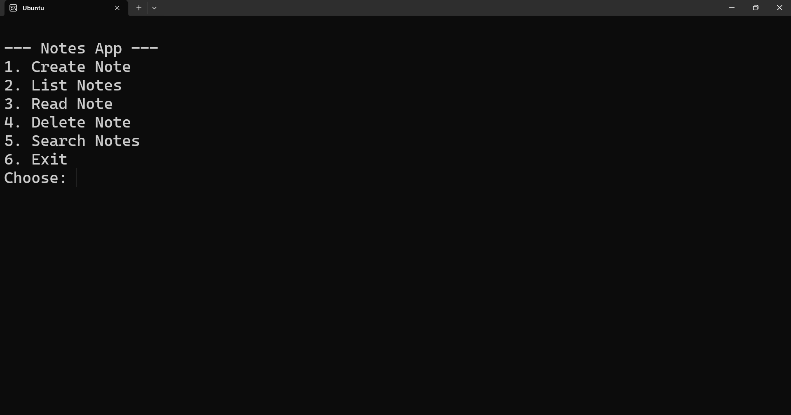

# NotesApp-CLI-Based
A secure CLI-based Notes Application developed in C++ that allows users to create, read, search, and delete notes. It supports password-protected private notes using Caesar Cipher encryption and stores all notes as text files. 

# 📝 Notes CLI App (C++)

A lightweight, secure Command Line Notes App built using C++. It supports encrypted private notes, public notes, search functionality, and simple note management through the terminal.

---

## 🚀 Features

- ✅ Create, Read, Delete, and Search Notes
- 🔐 Password-Protected Private Notes (Caesar Cipher encryption)
- 📂 All notes stored as `.txt` files in a `notes/` folder
- 🔍 Search public notes by title or content
- 🧹 Auto-clears the terminal screen for better UX
- 💻 Works on both Linux and Windows terminals

---

## 📸 Preview

Here’s a quick look at the CLI Notes App:

---

## 🛠️ How to Run

1. Make sure you have a C++ compiler (`g++`) installed.

2. Clone the repo:
 
git clone https://github.com/Amodkhurasiya/NotesApp-CLI-Based.git
cd notes-cli-app
mkdir notes
g++ main.cpp -o notes-app
./notes-app       # Linux/macOS
notes-app.exe     # Windows (or just run in PowerShell)

3. File Structure
notes-cli-app/
├── main.cpp
├── README.md
└── notes/
    ├── your_note.txt
    └── ...

4. Contributing
Contributions are welcome! Feel free to fork this repo and suggest changes.
